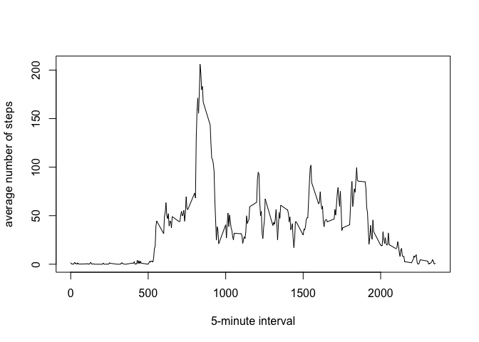

# Reproducible Research: Peer Assessment 1


## Loading and preprocessing the data

```r
data<-read.csv("activity.csv")
data$date<-as.Date(data$date)
```


## What is mean total number of steps taken per day?

```r
df<-do.call(rbind,by(data,INDICES = data$date,function(x){df<-data.frame(day=x$date[1],total_steps=sum(x$step,na.rm=T))}))
rownames(df)<-NULL
df
```

```
##           day total_steps
## 1  2012-10-01           0
## 2  2012-10-02         126
## 3  2012-10-03       11352
## 4  2012-10-04       12116
## 5  2012-10-05       13294
## 6  2012-10-06       15420
## 7  2012-10-07       11015
## 8  2012-10-08           0
## 9  2012-10-09       12811
## 10 2012-10-10        9900
## 11 2012-10-11       10304
## 12 2012-10-12       17382
## 13 2012-10-13       12426
## 14 2012-10-14       15098
## 15 2012-10-15       10139
## 16 2012-10-16       15084
## 17 2012-10-17       13452
## 18 2012-10-18       10056
## 19 2012-10-19       11829
## 20 2012-10-20       10395
## 21 2012-10-21        8821
## 22 2012-10-22       13460
## 23 2012-10-23        8918
## 24 2012-10-24        8355
## 25 2012-10-25        2492
## 26 2012-10-26        6778
## 27 2012-10-27       10119
## 28 2012-10-28       11458
## 29 2012-10-29        5018
## 30 2012-10-30        9819
## 31 2012-10-31       15414
## 32 2012-11-01           0
## 33 2012-11-02       10600
## 34 2012-11-03       10571
## 35 2012-11-04           0
## 36 2012-11-05       10439
## 37 2012-11-06        8334
## 38 2012-11-07       12883
## 39 2012-11-08        3219
## 40 2012-11-09           0
## 41 2012-11-10           0
## 42 2012-11-11       12608
## 43 2012-11-12       10765
## 44 2012-11-13        7336
## 45 2012-11-14           0
## 46 2012-11-15          41
## 47 2012-11-16        5441
## 48 2012-11-17       14339
## 49 2012-11-18       15110
## 50 2012-11-19        8841
## 51 2012-11-20        4472
## 52 2012-11-21       12787
## 53 2012-11-22       20427
## 54 2012-11-23       21194
## 55 2012-11-24       14478
## 56 2012-11-25       11834
## 57 2012-11-26       11162
## 58 2012-11-27       13646
## 59 2012-11-28       10183
## 60 2012-11-29        7047
## 61 2012-11-30           0
```

```r
hist(df$total_steps,main="Total number of steps per day",xlab="Total steps")
```

 

```r
#Mean
mean(df$total_steps)
```

```
## [1] 9354.23
```

```r
#Median
median(df$total_steps)
```

```
## [1] 10395
```

## What is the average daily activity pattern?

```r
df1<-do.call(rbind,by(data,INDICES = data$interval,function(x){df<-data.frame(interval=x$interval[1],mean_step=mean(x$step,na.rm=T))}))
rownames(df1)<-NULL
plot(df1$interval,df1$mean_step,type="l",xlab="5-minute interval",ylab="average number of steps")
```

 

```r
#maximum number of steps, on average
df1[df1$mean_step==max(df1$mean_step),]
```

```
##     interval mean_step
## 104      835  206.1698
```
We observe that the interval 835 contains the maximum number of steps which is 206.1698113.


## Imputing missing values

```r
#Number of missing values
sum(!complete.cases(data))
```

```
## [1] 2304
```

```r
##Use the data from df1 (that contains the mean values per interval) to impute the missing values
data_nm<-merge(data,df1)
data_nm$steps_nm<-mapply(function(s,mean_s)if(is.na(s))return(mean_s) else return(s),s=data_nm$steps,mean_s=data_nm$mean_step)
```
The numer of rows with at least one missing value (NA) is 2304


```r
df2<-do.call(rbind,by(data_nm,INDICES = data_nm$date,function(x){df<-data.frame(day=x$date[1],total_steps=sum(x$steps_nm,na.rm=T))}))
rownames(df2)<-NULL

hist(df2$total_steps,main="Total number of steps per day \n (imputed missing values)",xlab="Total steps")
```

 

```r
#Mean
mean(df2$total_steps)
```

```
## [1] 10766.19
```

```r
#Median
median(df2$total_steps)
```

```
## [1] 10766.19
```
As we can note in the report, the values do change with respect to the dataset tht contains missing values. In particular the histogram seems less skewed and the man and median agree one another. It seems that impact of imputing missing data makes the variable look more normally distributed.


## Are there differences in activity patterns between weekdays and weekends?

```r
data_nm$datewkdtype<-as.factor(sapply(data_nm$date,function(s)if(weekdays(s,abbreviate = T)%in% c("Sat","Sun")) return("weekend") else return("weekday")))

df3<-do.call(rbind,by(data_nm,INDICES = list(data_nm$datewkdtype,data_nm$interval),function(x){df<-data.frame(datewkdtype=x$datewkdtype[1],interval=x$interval[1],mean_step=mean(x$steps_nm,na.rm=T))}))
rownames(df3)<-NULL
par(mfrow=c(2,1))
plot(df3$interval[df3$datewkdtype=="weekend"],df3$mean_step[df3$datewkdtype=="weekend"],type="l",xlab="5-minute interval",ylab="average number of steps",main="weekend")
plot(df3$interval[df3$datewkdtype=="weekday"],df3$mean_step[df3$datewkdtype=="weekday"],type="l",xlab="5-minute interval",ylab="average number of steps",main="weekday")
```

 
